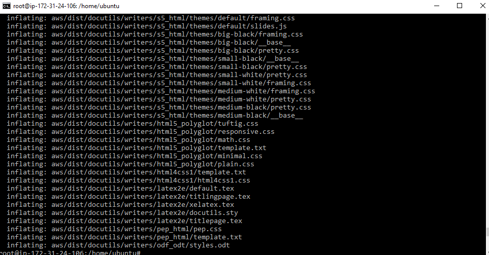

# AWS Resource Listing Automation Script
## Overview
This repository contains a script designed to automate the process of listing all resources within an AWS account. The script leverages AWS SDKs to query and aggregate information from various AWS services, providing a comprehensive overview of your AWS infrastructure. This is particularly useful for auditing, cost management, and ensuring compliance with best practices.

The focus of this project is to provide a solution for listing resources of a user 
on AWS in an automated way, and basically could be used to perform cron job as the case may suit the user and the need in the line of automation.

## Supported Services
The script currently supports listing resources for the following AWS services:

1. EC2
2. RDS
3. S3
4. CloudFront
5. VPC
6. IAM
7. Route53
8. CloudWatch
9. CloudFormation
10. Lambda
11. SNS
12. SQS
13. DynamoDB
14. EBS

## Features
- Multi-Region Support: The script can query resources across multiple AWS regions.
- Service Coverage: Lists resources from major AWS services such as EC2, S3, RDS, Lambda, and more.
- Output Formats: Results can be outputted in plain text or saved to a file for easy integration with other tools.
- Error Handling: Includes basic error handling to manage API rate limits and service-specific issues.


## Prerequisites
Before running the script, ensure you have the following:

AWS CLI: Installed and configured with the necessary permissions to query AWS resources.

Bash Shell: The script is written for Unix-like environments (Linux, macOS, WSL on Windows).

IAM Permissions: The IAM user or role running the script should have read-only permissions to all AWS services being queried.

## Setup

### STEPS
1. clone the Repository:
```sh
https://github.com/Aymogul/Aws-resource-script.git
```

2. Install nstall AWS CLI
```sh
curl "https://awscli.amazonaws.com/awscli-exe-linux-x86_64.zip" -o "awscliv2.zip"
unzip awscliv2.zip
sudo ./aws/install
```
 
3. Configure AWS CLI:
Ensure your AWS CLI is configured with the necessary credentials and default region
```sh
aws configure
```

4. Make script Executable:
Give execution permission to the script
```sh
chmod +x aws_resource_list.sh
or 
chmod 771 aws_resource_list.sh
```

### Usage 
1. Run the script
This can be executed directly from the command line after you have logged into an EC2 via ssh or puTTY
```sh
./aws_resource_list.sh <aws_region> <aws_service>
```
example usage
```sh
./aws_resource_list.sh us-east-1 ec2
```
2. Output:
This script will run and the output of the AWS resource list will be outputed to `aws_resources.txt`.
```sh
./_aws_resource_list.sh > aws_resources.txt
```
3. Customization of Regions and other Variables:
By default, the script will query resources in all regions. You can edit the regions variable in the script to specify particular regions:
```sh
regions="us-east-1"
```
This command will list all EC2 instances in the `us-east-1` region.

4. Valid AWS Services:

The script supports various services like `ec2`, `rds`, `s3`, `cloudfront`, `vpc`, `iam`, `route53`, `cloudwatch`, `cloudformation`, `lambda`, `sns`, `sqs`, `dynamodb`, and `ebs`.
 
### Error Handling
AWS CLI Not Installed: The script checks if AWS CLI is installed and configured. If not, it will prompt the user to install and configure it.
Invalid Service: If an unsupported service is specified, the script will return an error message.

### Customization
Additional Services: You can modify the script to include additional AWS services by adding new cases to the case block.
Output Format: The script can be enhanced to format output in different ways (e.g., JSON, CSV) depending on your requirements.

### Contribution
Contributions are welcome! If you have improvements or additional features, feel free to fork the repository and submit a pull request.

### License
This project is licensed under the MIT License. See the LICENSE file for more details.

This README provides a comprehensive guide to setting up, using, and customizing the AWS Resource Listing Automation Script. With this script, you can efficiently inventory and manage AWS resources across various services and regions.


